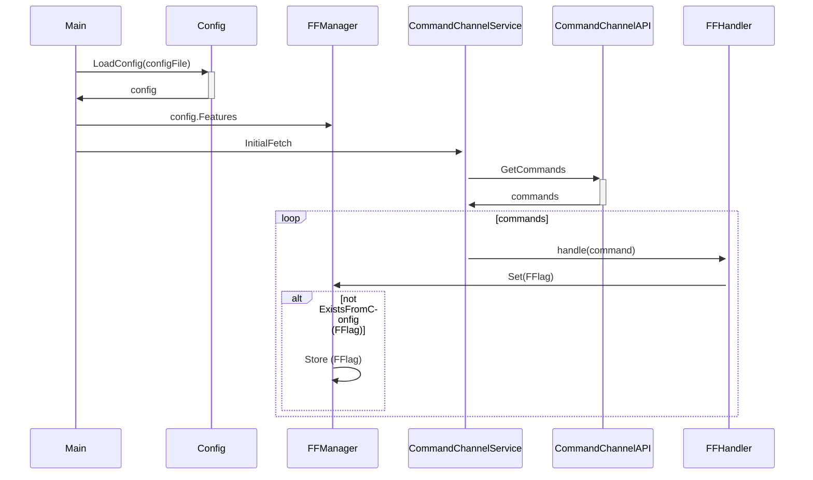

```mermaid
sequenceDiagram
    Main->>+Config: LoadConfig(configFile)
    Config->>-Main: config
    Main->>FFManager: config.Features
    Main->>+CommandChannelService: InitialFetch
    CommandChannelService->>+CommandChannelAPI: GetCommands
    CommandChannelAPI->>-CommandChannelService: commands
    loop commands
        CommandChannelService->>+FFHandler: handle(command)
        FFHandler->>FFManager: Set(FFlag)
        alt not ExistsFromConfig (FFlag)
            FFManager->>FFManager: Store (FFlag)
        end
    end
```
            
