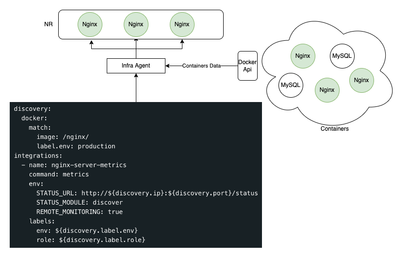
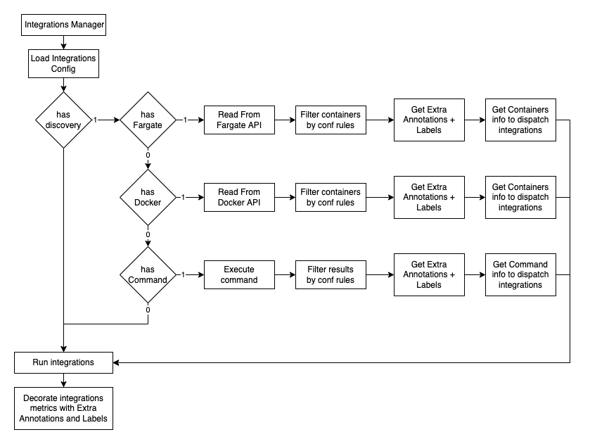

## Discovery
Our container auto-discovery feature allows you to configure an integration to automatically monitor services that run 
in multiple containers. In an integration's configuration file, you can set containers' matching criteria, and the agent 
executes the integration for each local container matching the criteria.

So with a single configuration file you can monitor multiple resources:


The metrics sent will also be decorated with these attributes:
* `image`: Container image name
* `imageId`: Container image Id
* `containerName`: Container name
* `containerId`: Container Id
* `label.*`: Labels from Docker/Fargate container 


Currently the Infrastructure Agent supports 2 discovery mechanisms:
* Docker
* Fargate (Experimental)




## Discovery Service
In the integration configuration file you can specify the Api to use (`docker`, `fargate` or `command`)

Docker:
```yaml
discovery:
  docker: # <-- service to use
    api_version:  1.39 # <-- docker api version (optional, default: 1.24)
```

Fargate:
```yaml
discovery:
  fargate: # <-- service to use
```

## TTL
You can specify a TTL for discovered services, so the service api will not be queried if the TTL is not expired. This
value is optional nad has a default value of 1 minute.

```yaml
discovery:
  ttl: 1h
  docker: 
    api_version:  1.39 
```

## Filter containers 
You can use matchers with regular expresions to filter the services to monitor. Its service type supports different matchers.

### Docker

You can use one or more of the supported matchers to filter the containers to monitor (all used conditions needs to be
met for a container to be filtered)

* `name`
* `image`
* `containerId`
* `label.*`
* `ip`
* `port`
* `ip.*`
* `ports.*`
* `private.ip`
* `private.ip.*`
* `private.port`
* `private.ports.*`

In the example below only the containers created from images conaining `nginx` and label `env=production` will be filtered.
```yaml
discovery:
  docker: 
    match:
      image: /nginx/
      label.env: production
```

### Fargate

You can use one or more of the supported matchers to filter the containers to monitor (all used conditions needs to be
met for a container to be filtered)

* `name`
* `image`
* `containerId`
* `label.*`
* `ip`
* `port`
* `ip.*`
* `ports.*`
* `private.ip`
* `private.ip.*`
* `private.port`
* `private.ports.*`

In the example below only the containers created from images conaining `nginx` and label `env=production` will be filtered.
```yaml
discovery:
  fargate: 
    match:
      image: /nginx/
      label.env: production
```

## Integration configuration
The data fetched by the discovery service can be used using placeholders in the configuration file. Any of the matchers
above can be used as a placeholder that will be replaced by the corresponding value form the container. The placeholders 
need to be prefixed with `discovery.` 

```yaml
discovery:
  docker:
    match:
      image: /nginx/
      label.env: production
      
integrations:
  - name: nginx-server-metrics
    command: metrics
    env:
      STATUS_URL: http://${discovery.ip}:${discovery.port}/status
      STATUS_MODULE: discover
      REMOTE_MONITORING: true
    labels:
      env: ${discovery.label.env}
      role: ${discovery.label.role}
      image: ${discovery.image}

```

