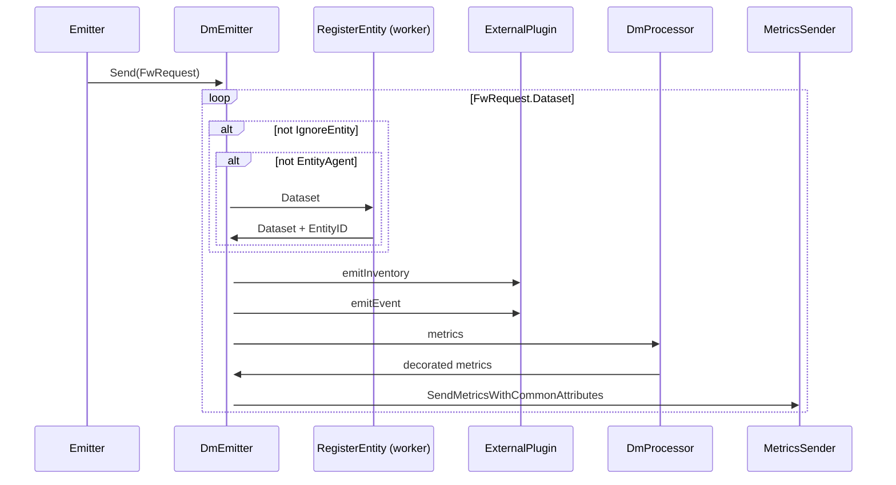

# Dimensional Metrics (v4)

The dimensional metrics package (dm) is responsible for processing and emitting the different data types that can be found in a v4 Integration SDK payload.

# Sequence diagram

            
