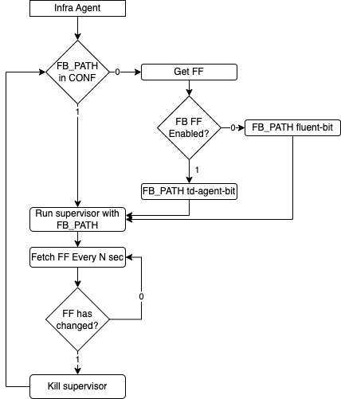

### Fluentbit supervisor

td-agent-bit is becoming fluent-bit in version 2.x, so the binary name and paths are changing. To prevent any issue
we will handle this under a Feature Flag.

#### Update 2023-03-13
This change will be only done for Windows for now as there is a bug present in FB 2.0.6 that is not fixed yet. The 
changes needed for Windows will be left in a draft PR

